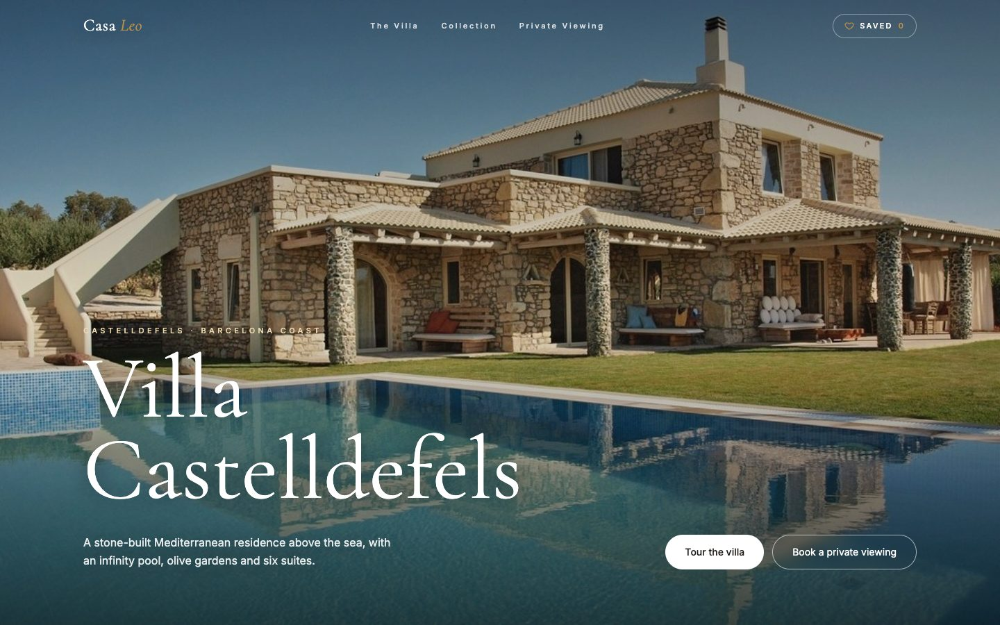
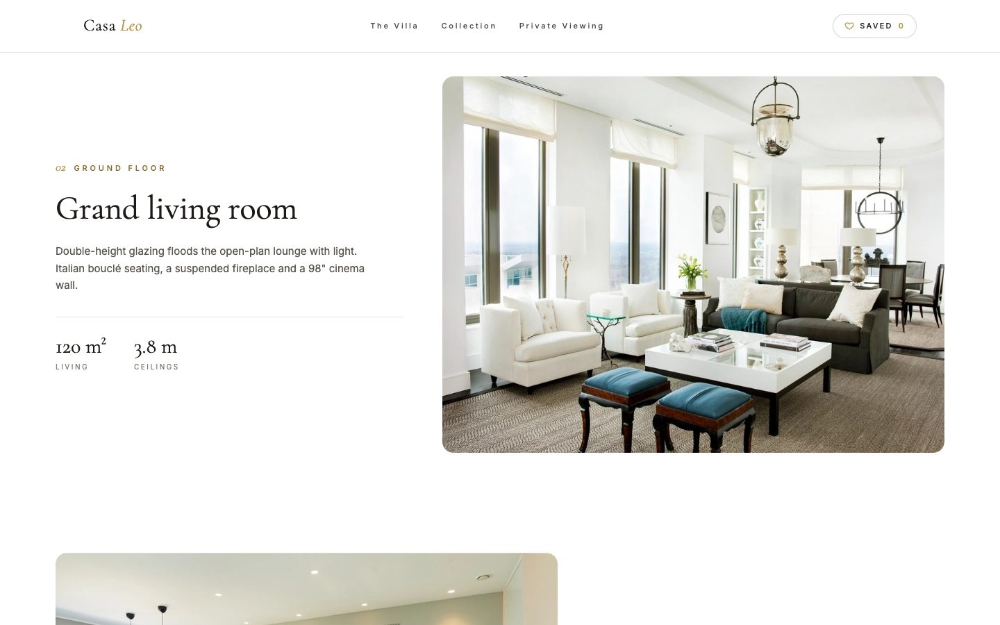
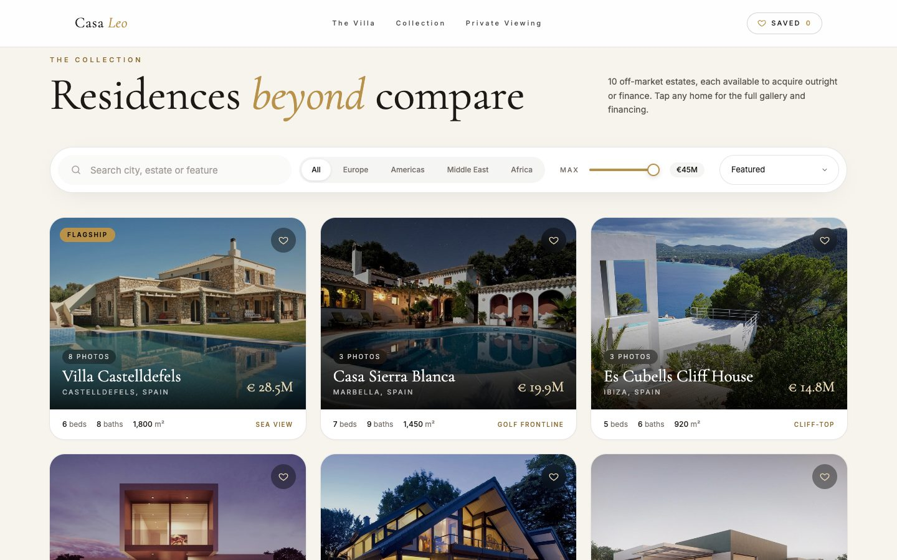
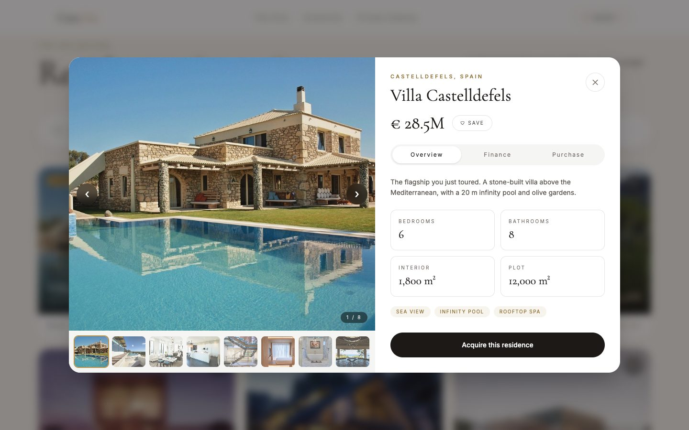

<div align="center">

# Casa <em>Leo</em> Estates

**A luxury real-estate showcase: one flagship villa told room by room, and a curated collection of homes you can browse, save, finance and reserve.**

[**View the live site →**](https://casa-leo.vercel.app)



</div>

---

## Overview

Casa Leo Estates is a single-page site for a fictional private property office. It opens on the flagship home, **Villa Castelldefels**, and walks through it one room at a time. Below that, the **Collection** holds ten estates, from a Monte Carlo penthouse to a Lekki duplex, each with a photo gallery, a mortgage calculator and a two-step reservation flow.

The design is clean and white, with an editorial feel. Every image is a real photograph, used under a public-domain or Creative Commons licence (see [Photo credits](#photo-credits)).

| The villa, room by room | The collection | A property |
| :---: | :---: | :---: |
|  |  |  |

## Features

### The flagship villa

- Full-screen hero photograph with a slow zoom-in and parallax as you scroll
- Seven rooms presented as alternating photo and text blocks, each photo opening like a curtain as it scrolls into view
- Key figures (price, suites, floor area, grounds) and a closing "Make it yours" call to action

### The collection

- Ten listings with full-bleed photo cards showing the name, location, price, beds, baths and floor area
- Search by city, estate or feature; filter by region; set a maximum price; sort by price or size
- Save favourites with the heart button; the header counter jumps you to your saved homes

### Property popup

- Photo gallery with arrows and thumbnails (the flagship has eight photos)
- **Overview:** description, key facts and feature tags
- **Finance:** deposit, interest-rate and term sliders with a live monthly-payment estimate
- **Purchase:** buy at the asking price or make an offer, add your details, confirm proof of funds, and receive a reservation reference

### Throughout

- Form fields whose labels float up as you type, custom dropdowns, filled-track sliders and toggle buttons
- A navigation bar that is transparent over the hero and turns solid white once you scroll
- Responsive from phone to wide desktop; the popup closes with <kbd>Esc</kbd>

## Tech stack

| | |
| --- | --- |
| Framework | [React 19](https://react.dev) |
| Build tool | [Vite 8](https://vite.dev) |
| Styling | [Tailwind CSS 4](https://tailwindcss.com), plus custom form controls in `src/index.css` |
| Animation | [GSAP 3](https://gsap.com) with ScrollTrigger and ScrollTo |
| Fonts | Cormorant Garamond (display) and Inter (text), via Google Fonts |
| Hosting | [Vercel](https://vercel.com) |

No backend: the listings live in a JavaScript file and all state (saved homes, reservations) stays in the browser for the session.

## Getting started

You need [Node.js](https://nodejs.org) 20 or newer.

```bash
git clone https://github.com/Nedu2022/casa-Leo.git
cd casa-Leo
npm install
npm run dev
```

Then open the address Vite prints (usually <http://localhost:5173>).

| Command | What it does |
| --- | --- |
| `npm run dev` | Start the development server with hot reload |
| `npm run build` | Build the production site into `dist/` |
| `npm run preview` | Serve the production build locally to check it |

## Project structure

```text
casa-Leo/
├── index.html                 Page shell, fonts and meta tags
├── public/assets/
│   ├── photos/                Listing photos (<id>-0.jpg is the cover) and CREDITS.json
│   └── rooms/                 Room photos for the flagship villa
├── src/
│   ├── main.jsx               React entry point
│   ├── App.jsx                Page layout, smooth scrolling, saved and reserved state
│   ├── index.css              Theme colours, fonts and form-control styles
│   ├── data/
│   │   ├── villa.js           Flagship hero text, key figures and the room-by-room story
│   │   └── listings.js        Every estate in the collection
│   └── components/
│       ├── Chrome.jsx         Loading screen and navigation bar
│       ├── Villa.jsx          Hero and the flagship villa sections
│       ├── Marketplace.jsx    Collection filters and listing cards
│       ├── PropertyModal.jsx  Gallery, overview, finance and purchase popup
│       ├── Contact.jsx        Private-viewing form and footer
│       └── Form.jsx           Shared inputs: Field, Segmented, Range
└── docs/                      Screenshots used in this README
```

## Making it your own

### Add or edit a listing

Listings are plain objects in [`src/data/listings.js`](src/data/listings.js). Drop the photos into `public/assets/photos/` named `<id>-0.jpg`, `<id>-1.jpg` and so on (the first one is the card cover), then add an entry:

```js
{
  id: 'lekki',                         // also the photo filename prefix
  photos: photos('lekki', 3),          // loads lekki-0.jpg … lekki-2.jpg
  name: 'Lekki Pearl Duplex',
  location: 'Lekki Phase 1, Lagos',
  region: 'Africa',                    // new regions appear in the filter automatically
  price: 3_400_000,                    // in euros
  beds: 5, baths: 6, area: 620, plot: 900,   // area and plot in m²
  tags: ['Duplex', 'Smart home', 'Gated estate'],
  blurb: 'A five-bedroom duplex in a gated Lekki estate…',
  credits: ['Photographer, CC BY 4.0'],      // optional; shown under the gallery
}
```

### Change the flagship villa

Edit [`src/data/villa.js`](src/data/villa.js): `VILLA` holds the hero photo, title, description and key figures; `ROOMS` is the room-by-room story (photo, label, title, description and optional figures); `CLOSING` is the photo behind "Make it yours".

### Change the colours

The palette is defined once at the top of [`src/index.css`](src/index.css):

```css
--color-gold: #b8914a;       /* accents, sliders, focus rings */
--color-gold-deep: #8a6a2f;  /* small gold text on white */
--color-ink: #1c1917;        /* headings, body text, dark buttons */
--color-cream: #f7f4ee;      /* the collection and form backgrounds */
```

## Deployment

The live site is hosted on Vercel at **<https://casa-leo.vercel.app>**. Vercel detects the Vite project automatically, so no configuration file is needed.

To publish a new version from your machine with the [Vercel CLI](https://vercel.com/docs/cli):

```bash
npm i -g vercel      # once
vercel login         # once
vercel --prod
```

The output in `dist/` is a plain static site, so it can also be hosted on Netlify, Cloudflare Pages or GitHub Pages: set the build command to `npm run build` and the output folder to `dist`.

## Photo credits

Every photograph is a real image used under its licence. Most are public domain (CC0) from [rawpixel](https://www.rawpixel.com) and [StockSnap](https://stocksnap.io), found through [Openverse](https://openverse.org). The two Tuscany photos come from [Wikimedia Commons](https://commons.wikimedia.org) under Creative Commons licences and are credited on the site:

- *Villa Pavesi Negri Baldini – Rustici* by **Syrio**, [CC BY-SA 4.0](https://creativecommons.org/licenses/by-sa/4.0/)
- *Hillside Farmhouse at Sunset* by **Eric Kilby**, [CC BY-SA 2.0](https://creativecommons.org/licenses/by-sa/2.0/)

The title, author, licence and source link for every image are recorded in [`public/assets/photos/CREDITS.json`](public/assets/photos/CREDITS.json). The interior photos show real rooms, but not the rooms of the house in the hero photograph.

## Disclaimer

This is a concept project. The estates, names, prices and descriptions are fictional, the forms do not send data anywhere, and nothing on the site is a real offer to sell property.
